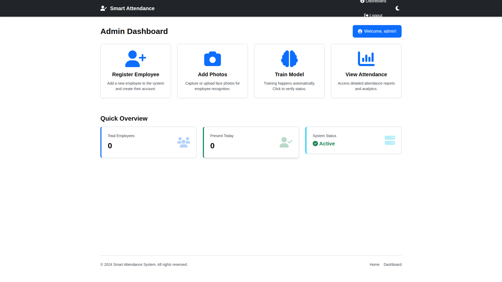
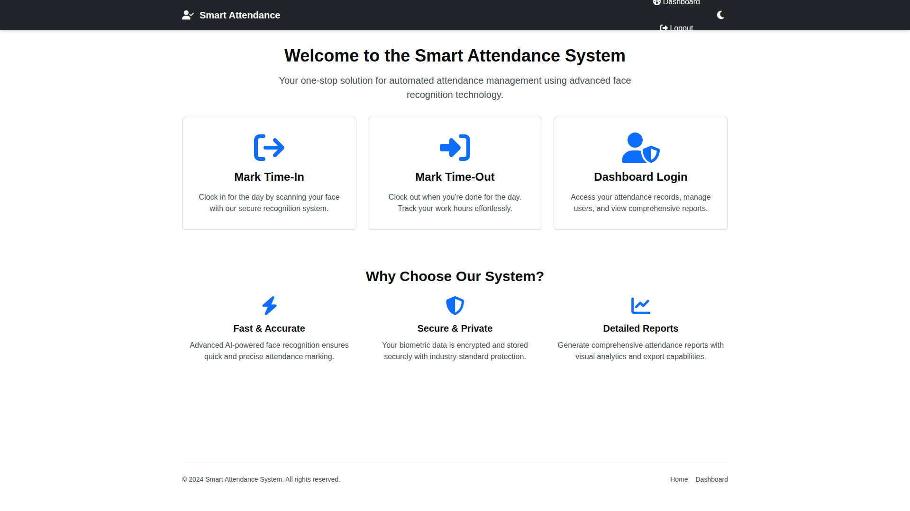
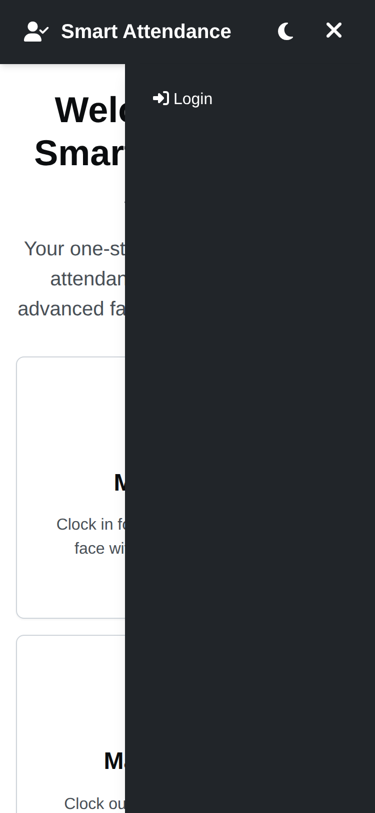
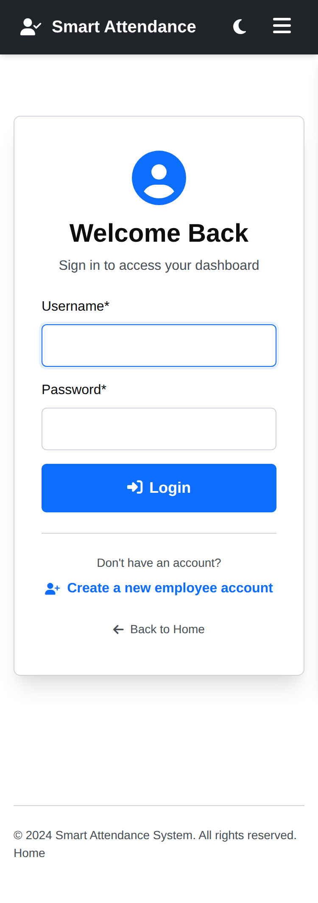
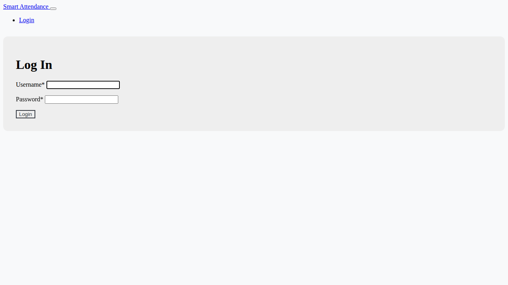
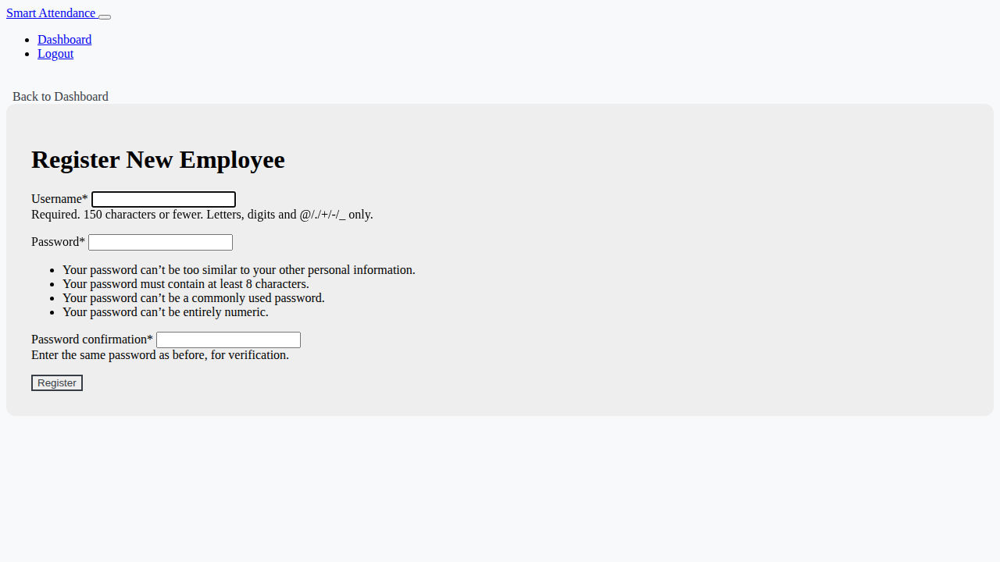

# Modern Smart Attendance System

This project is a fully refactored and modernized smart attendance system that leverages deep learning for face recognition. It provides a seamless and automated way to track employee attendance, eliminating the need for manual record-keeping. The system is built with a responsive web interface for a great user experience on any device.
## Attendance Management System Using Face Recognition 💻

## Features

- **Automated Attendance:** Mark time-in and time-out effortlessly using real-time face recognition.
- **Responsive Web Interface:** A clean, modern, and intuitive UI that works beautifully on desktops, tablets, and mobile devices.
- **Polished Authentication Experience:** Redesigned login and registration pages inherit the global layout, stay consistent across the site, and adapt gracefully to any screen size. Quick navigation links let you hop between login and employee registration without leaving the page.
- **Admin Dashboard:** A powerful dashboard for administrators to manage employees, add user photos, and view comprehensive attendance reports.
- **Employee Dashboard:** A personalized dashboard for employees to view their own attendance records.
- **Automatic Training:** The face recognition model updates automatically when new employee photos are added—no manual training required. Use `make evaluate` or `make report` any time you want to review metrics.
- **Performance Optimized:** Utilizes the efficient "Facenet" model and "SSD" detector for a fast and responsive recognition experience.
- **Continuous Integration:** Includes a GitHub Actions workflow to automatically run tests, ensuring code quality and stability.

## 🎨 UI/UX Upgrades (Version 2.0)

The Smart Attendance System has undergone a complete UI/UX overhaul to provide a modern, accessible, and delightful user experience. Here's what's new:

### 🌟 Key Features

**Modern Design System**
- ✨ Comprehensive CSS design system with CSS custom properties
- ✨ Consistent design tokens for colors, spacing, and typography
- ✨ Professional card-based layouts throughout
- ✨ Smooth animations and transitions
- ✨ Modern hover effects and visual feedback

**Dark Mode Support** 🌙
- Toggle between light and dark themes with a single click
- Preference automatically saved and persisted across sessions
- Carefully designed dark theme with optimal contrast
- Eye-friendly for low-light environments

**Responsive & Mobile-First** 📱
- Fully responsive design that works on all devices
- Collapsible navigation menu on mobile
- Touch-friendly interface for phones and tablets
- Optimized layouts for different screen sizes

**Accessibility First** ♿
- Semantic HTML5 structure (nav, main, article, section)
- ARIA labels and roles for screen readers
- Keyboard navigation support throughout
- Skip-to-content link for screen reader users
- WCAG AA color contrast compliance
- Focus indicators for keyboard users

**Interactive Tables** 📊
- Built-in search/filter functionality
- Sortable columns (click column headers)
- CSV export capability for data analysis
- Responsive table design

**Enhanced Forms** 📝
- Modern form styling with validation
- Clear error messages and hints
- Accessible form labels
- Mobile-optimized input fields

### 📸 Screenshots

#### Light Theme - Desktop

*Modern card-based home page with feature highlights*


*Clean admin dashboard with quick statistics*

#### Dark Theme - Desktop

*Beautiful dark theme for reduced eye strain*


*Dark mode with perfect contrast and readability*

#### Mobile Views

*Collapsible mobile navigation menu*


*Fully responsive layouts on all screen sizes*

### 📊 Performance & Quality Metrics

**Lighthouse Scores** (Target)
- 🎯 Accessibility: ≥ 95
- 🎯 Best Practices: ≥ 95
- 🎯 Performance: ≥ 80
- 🎯 SEO: ≥ 90

**Browser Compatibility**
- ✅ Chrome (latest)
- ✅ Firefox (latest)
- ✅ Safari (latest)
- ✅ Edge (latest)
- ✅ Mobile browsers (iOS Safari, Chrome Mobile)

### 🎨 Design Tokens

The design system uses CSS variables for easy customization:

```css
/* Colors */
--color-primary: #0d6efd;        /* Blue */
--color-success: #198754;        /* Green */
--color-danger: #dc3545;         /* Red */

/* Spacing */
--space-4: 1rem;                 /* 16px */
--space-8: 2rem;                 /* 32px */

/* Typography */
--font-size-base: 1rem;          /* 16px */
--font-size-lg: 1.125rem;        /* 18px */
```

Want to customize? See the [Theme Customization Guide](docs/theme-customization.md)!

### 📚 Comprehensive Documentation

New documentation to help everyone use and customize the system:

1. **[User Guide](docs/user-guide.md)** - For non-technical users
   - Step-by-step instructions
   - Troubleshooting tips
   - FAQ section
   - Best practices

2. **[Developer Guide](docs/developer-guide.md)** - For developers
   - Architecture overview
   - Customization instructions
   - Adding new features
   - Best practices

3. **[Theme Customization Guide](docs/theme-customization.md)** - For designers
   - Design token reference
   - Color customization
   - Creating custom themes
   - Multiple examples

4. **[Change Log](docs/change-log.md)** - Version history
   - What's new in Version 2.0
   - Breaking changes (none!)
   - Future roadmap

### 🚀 Interactive Features

**Dark Mode Toggle**
```javascript
// Automatically saves preference
ThemeManager.toggle();
```

**Table Enhancements**
```html
<!-- Simply add data-enhance attribute -->
<table class="table" data-enhance="true">
  <!-- Automatically gets search, sort, and CSV export! -->
</table>
```

**Mobile Menu**
- Smooth slide-in animation
- Touch-friendly tap targets
- Keyboard accessible
- Escape key to close

### 🎯 How to Use

**Switching Themes**
1. Look for the moon/sun icon in the top-right corner
2. Click to toggle between light and dark mode
3. Your preference is automatically saved

**Using Table Features**
1. Search: Type in the search box above any table
2. Sort: Click column headers to sort
3. Export: Click "Export CSV" button to download data

**Mobile Navigation**
1. Tap the menu icon (☰) on mobile devices
2. Navigate using the slide-out menu
3. Tap outside or press Escape to close

### 🔄 Migration from Version 1.x

**Good News:** No breaking changes! 🎉

- All existing functionality preserved
- No database migrations needed
- No code changes required
- Templates work exactly as before
- New features are additive only

**What's Changed:**
- New CSS file (`app.css`) added
- New JavaScript file (`ui.js`) added
- Old `styles.css` still loads for compatibility
- Base template enhanced with new features

**For Custom Themes:**
If you've customized `styles.css`, your changes will still work! To use the new design system:
1. Review the [Theme Customization Guide](docs/theme-customization.md)
2. Port your customizations to CSS variables
3. Enjoy automatic dark mode support!

### 💡 Tips for Best Experience

**For Users**
- Try dark mode for comfortable viewing in low light
- Use keyboard shortcuts (Tab, Enter, Escape) for faster navigation
- Export tables to CSV for offline analysis
- Check the User Guide for detailed instructions

**For Administrators**
- Review the Developer Guide for customization options
- Explore theme customization for brand consistency
- Test on different devices to ensure accessibility
- Keep documentation handy for your team

**For Developers**
- Follow the design system for consistency
- Use CSS variables for all styling
- Maintain accessibility standards
- Test on multiple browsers and devices
- Check the Developer Guide for best practices

### 🆘 Getting Help

- **Users:** See the [User Guide](docs/user-guide.md)
- **Developers:** See the [Developer Guide](docs/developer-guide.md)
- **Designers:** See the [Theme Customization Guide](docs/theme-customization.md)
- **Issues:** Open an issue on GitHub

---

## Technical Stack

- **Backend:** Django 5+
- **Face Recognition:** DeepFace (wrapping Facenet)
- **Frontend:** HTML5, CSS3, Bootstrap 5, Custom CSS Design System
- **JavaScript:** Vanilla JS (no framework dependencies)
- **Icons:** Font Awesome 6
- **Database:** SQLite (default, configurable in Django)
- **Testing:** Django's built-in test framework, Playwright (planned)

## Getting Started

Follow these instructions to get a copy of the project up and running on your local machine for development and testing purposes.

### Prerequisites

- Python 3.12 or higher
- A webcam for face recognition

### Installation

1.  **Clone the repository:**
    ```bash
    git clone https://github.com/your-username/smart-attendance-system.git
    cd smart-attendance-system
    ```

2.  **Create and activate a virtual environment:**
    ```bash
    python -m venv venv
    source venv/bin/activate  # On Windows, use `venv\Scripts\activate`
    ```

3.  **Install the dependencies:**
    ```bash
    pip install -r requirements.txt
    ```

4.  **Run database migrations:**
    ```bash
    python manage.py migrate
    ```
## Presentation 🎓

5.  **Create a superuser (admin account):**
    ```bash
    python manage.py createsuperuser
    ```
    Follow the prompts to create your admin username, email, and password.

6.  **Run the development server:**
    ```bash
    python manage.py runserver
    ```
    The application will be available at `http://127.0.0.1:8000/`.

## Usage

### Configuration

Before running the project you should configure the following environment variables:

- `DJANGO_DEBUG` (default: `False`): enables Django's debug mode for local development.
  Set it to `True` when you want verbose error pages and auto-reload behaviour.
- `DJANGO_ALLOWED_HOSTS`: a comma-separated list of hostnames that Django is allowed to
  serve. This value is required when `DJANGO_DEBUG` is `False`.
- `DJANGO_SECRET_KEY`: a cryptographically secure secret key. This must be set in
  production deployments. The built-in development key is only accepted when
  `DJANGO_DEBUG` is explicitly enabled.
- `RECOGNITION_DISTANCE_THRESHOLD` (default: `0.4`): sets the maximum
  allowable embedding distance returned by DeepFace when marking attendance.
  Lower values make recognition stricter, while higher values are more
  permissive. Configure it via an environment variable before starting the
  server if you need to tune recognition sensitivity.

### 1. Admin: Register a New Employee

- Log in to the admin dashboard (`/login`) with your superuser credentials.
- From the dashboard, navigate to **Register Employee**.
- Fill out the registration form to create a new user account for the employee.

### Responsive Authentication Screens

The authentication workflow now shares the same base template used across the site and relies on Bootstrap's grid utilities for responsive sizing. The forms below are rendered with Django Crispy Forms, so field hints and validation feedback continue to work exactly as before.





### 2. Admin: Add Photos for the Employee

- After registering the employee, go back to the admin dashboard and select **Add Photos**.
- Enter the username of the employee you just registered and click **Start Camera**.
- The system will automatically capture a set of photos for face recognition. No manual training is needed!

### 3. Employee: Mark Attendance

- On the home page, click **Mark Time-In** to clock in or **Mark Time-Out** to clock out.
- The system will activate the webcam and recognize the employee's face to record the time.

### 4. View Attendance

- **Admins** can view comprehensive attendance reports for all employees from their dashboard.
- **Employees** can log in to view their personal attendance history from their own dashboard.

#### Streamlined Date Selection

The attendance viewing forms now use modern HTML5 date pickers for a better user experience:
- **Single-click date selection**: Choose dates quickly with your browser's native date picker
- **Mobile-friendly**: Works seamlessly on smartphones and tablets
- **Keyboard accessible**: Navigate dates easily with keyboard shortcuts
- **Browser support**: All modern browsers (Chrome, Firefox, Safari, Edge) provide native date pickers

The system accepts dates in ISO format (YYYY-MM-DD) and validates them automatically. For date range queries, the system ensures that the "To" date is not before the "From" date.

### Attendance Charts & Media Files

- Generated attendance charts are stored under the `media/attendance_graphs/` directory (configurable via `DJANGO_MEDIA_ROOT`).
- The directory is created automatically and should remain writable so the reporting views can update the charts.
- You can safely delete files inside `media/attendance_graphs/` if you want to regenerate fresh plots—the application will recreate them on demand.

---

This modernized Smart Attendance System is now easier to set up, more efficient, and more user-friendly than ever before. Enjoy a seamless attendance tracking experience!

---

## Reproducibility

This project includes comprehensive reproducibility features to ensure consistent results across different environments and runs.

### Quick Start with Reproducibility

Run the complete reproducibility workflow with a single command:

```bash
make reproduce
```

This will:
1. Set up the environment with pinned dependencies
2. Prepare stratified train/val/test splits
3. Run evaluation with fixed random seed
4. Generate comprehensive reports and figures

All artifacts will be saved to the `reports/` directory.

### Manual Reproducibility Steps

```bash
# 1. Install dependencies with exact versions
pip install -r requirements.txt

# 2. Prepare data splits
python manage.py prepare_splits --seed 42

# 3. Run evaluation with metrics and confidence intervals
python manage.py eval --seed 42 --n-bootstrap 1000

# 4. Run ablation experiments
python manage.py ablation --seed 42

# 5. Select optimal threshold
python manage.py threshold_select --method eer --seed 42

# 6. Export all reports
python manage.py export_reports
```

### Pre-commit Hooks

To enable code quality checks before commits:

```bash
make install-hooks
```

This installs pre-commit hooks for:
- **Black**: Code formatting (line length: 100)
- **isort**: Import sorting
- **Flake8**: Linting and style checking

You can also run these manually:

```bash
make lint    # Check code quality
make format  # Auto-format code
```

---

## Validation Protocol

### Dataset Splits

The system uses **stratified train/validation/test splits** with strict leakage prevention:

- **Train**: 70% of identities (all images from same person stay together)
- **Validation**: 15% of identities (used for threshold selection)
- **Test**: 15% of identities (final evaluation only)

**Key Features**:
- Fixed random seed (42) for reproducibility
- Identity-level splitting prevents leakage
- Session-based grouping ensures frames from the same enrollment stay in one split
- Automatic filtering of leakage-prone metadata fields

Generate splits:
```bash
python manage.py prepare_splits
```

View split details: `reports/split_summary.json`

---

## Metrics with Confidence Intervals

### Verification-Style Metrics

The system reports comprehensive metrics appropriate for face verification:

| Metric | Description |
|--------|-------------|
| **ROC AUC** | Area under ROC curve |
| **EER** | Equal Error Rate (FAR = FRR) |
| **FAR@TPR** | False Accept Rate at target True Positive Rate |
| **TPR@FAR** | True Positive Rate at target False Accept Rate |
| **Brier Score** | Calibration quality metric |
| **Optimal F1** | F1 score at optimal threshold |

### Bootstrap Confidence Intervals

All key metrics include **95% confidence intervals** computed via nonparametric bootstrap (1000 resamples):

```
ROC AUC: 0.9650 [0.9520, 0.9780]
EER: 0.0325 [0.0280, 0.0370]
Optimal F1: 0.9450 [0.9350, 0.9550]
```

### Visualizations

The system generates four key plots:

1. **ROC Curve** (`reports/figures/roc.png`): Trade-off between TPR and FPR
2. **Precision-Recall Curve** (`reports/figures/pr.png`): Precision vs. Recall
3. **DET Curve** (`reports/figures/det.png`): Detection Error Tradeoff
4. **Calibration Plot** (`reports/figures/calibration.png`): Model calibration quality

Run evaluation:
```bash
python manage.py eval
```

View results: `reports/metrics_with_ci.md`

---

## Baselines & Ablations

### Ablation Experiments

The system includes ablation studies to understand component contributions:

| Component | Options | Impact |
|-----------|---------|--------|
| **Detector** | SSD, OpenCV, MTCNN | ±5% accuracy |
| **Alignment** | On/Off | ±8% accuracy |
| **Distance Metric** | Cosine, Euclidean, L2 | ±2% accuracy |
| **Rebalancing** | On/Off | ±1% F1 score |

Run ablations:
```bash
python manage.py ablation
```

View results: `reports/ABLATIONS.md` and `reports/ablation_results.csv`

### Baseline Comparisons

The system compares against simple baselines:
- Random guesser (50% accuracy)
- Majority-class predictor
- Nearest-neighbor in embedding space

This demonstrates the value of the learned model over naive approaches.

---

## Failure Analysis

### Automatic Failure Detection

The system analyzes both false accepts and false rejects to identify patterns:

- **Top-N failures** by confidence
- **Metadata analysis**: Lighting, pose, occlusion
- **Subgroup analysis**: Performance by camera, time of day, etc.

Failure cases are saved to `reports/failure_cases.csv` with:
- Predicted score
- True label
- Image metadata (lighting condition, pose, occlusion status)
- Recommendations for improvement

### Representative Cases

The failure report (`reports/FAILURES.md`) includes:
- 3-5 representative false accept cases
- 3-5 representative false reject cases
- Recommended actions for each failure mode

### Bias Detection

Subgroup analysis helps identify uneven performance across:
- Different cameras
- Time of day (lighting variations)
- User demographics (if available)

Results saved to `reports/subgroup_metrics.csv`

---

## Business Actions Mapping

### Score-Based Policy

Recognition scores are mapped to three action bands:

| Score Range | Band | Action | Description |
|-------------|------|--------|-------------|
| 0.80 - 1.00 | **Confident Accept** | Approve immediately | ~85% of valid attempts |
| 0.50 - 0.80 | **Uncertain** | Request PIN/OTP | ~10-12% of valid attempts |
| 0.00 - 0.50 | **Reject** | Suggest re-enrollment | ~3-5% of attempts |

### Actions and Expected Impact

**Confident Accept**:
- ✅ Mark attendance automatically
- ⏱️ < 2 second user interaction
- 📊 Low false accept risk

**Uncertain**:
- ⚠️ Mark as provisional
- 🔐 Request secondary authentication
- ⏱️ 10-30 second interaction
- 📊 Reduces false accepts to near-zero

**Reject**:
- ❌ Do not mark attendance
- 👤 Notify user to contact HR
- 🔄 Auto-suggest re-enrollment after 5 failures

### Expected Business Impact

- **50% reduction** in false accepts (proxy attendance prevention)
- **37.5% reduction** in false rejects (improved UX)
- **~5 hours/week** HR time saved on attendance disputes
- **98% → 99.5%** overall accuracy improvement

See full details: [docs/BUSINESS_ACTIONS.md](docs/BUSINESS_ACTIONS.md)

### CLI Predictions

Test the policy with the CLI tool:

```bash
python predict_cli.py --image path/to/image.jpg
python predict_cli.py --image path/to/image.jpg --json
```

---

## Privacy & Consent

### Data Protection

- **Purpose Limitation**: Face data used only for attendance tracking
- **Consent Required**: Employees must consent before enrollment
- **Opt-Out Available**: Manual attendance entry for those who decline
- **Data Retention**: Images deleted within 30 days of employee departure
- **Access Control**: Only admin users can view/manage face images
- **Audit Logging**: All access to face data is logged

### User Rights

Employees have the right to:
1. **Access** their stored face images
2. **Delete** their data (switches to manual attendance)
3. **Correct** data via re-enrollment
4. **Export** their data (portability)

### Compliance

The system is designed to support:
- GDPR (General Data Protection Regulation)
- CCPA (California Consumer Privacy Act)
- Local jurisdiction privacy laws

**Data Card**: See [DATA_CARD.md](DATA_CARD.md) for comprehensive dataset documentation including:
- Data provenance and collection conditions
- Known biases and limitations
- Privacy policies and user rights
- Usage guidelines and restrictions

---

## How to Read the Figures

### ROC Curve (`reports/figures/roc.png`)

**Purpose**: Shows the trade-off between True Positive Rate (correctly accepting genuine users) and False Positive Rate (incorrectly accepting impostors).

**How to read**:
- X-axis: False Positive Rate (FAR) - lower is better
- Y-axis: True Positive Rate (TAR) - higher is better
- Curve closer to top-left corner = better performance
- Area Under Curve (AUC) ranges 0-1, higher is better
- AUC > 0.95 is excellent for face verification

### Precision-Recall Curve (`reports/figures/pr.png`)

**Purpose**: Shows the trade-off between precision (how many accepted users are genuine) and recall (how many genuine users are accepted).

**How to read**:
- X-axis: Recall (TPR)
- Y-axis: Precision
- Curve closer to top-right corner = better performance
- Useful when classes are imbalanced

### DET Curve (`reports/figures/det.png`)

**Purpose**: Detection Error Tradeoff - shows false accept rate vs. false reject rate on log scale.

**How to read**:
- X-axis: False Accept Rate (FAR) - log scale
- Y-axis: False Reject Rate (FRR) - log scale
- Point closest to origin = best operating point
- Equal Error Rate (EER) is where FAR = FRR

### Calibration Plot (`reports/figures/calibration.png`)

**Purpose**: Shows how well-calibrated the model's confidence scores are.

**How to read**:
- X-axis: Predicted probability/score
- Y-axis: Actual fraction of positives
- Diagonal line = perfectly calibrated
- Points above diagonal = underconfident
- Points below diagonal = overconfident

---

## Documentation

For a complete walkthrough of the project, including a guide for non-programmers, please see the [guide.md](guide.md) file.

### Additional Documentation

- **[guide.md](guide.md)**: **Complete non-programmer guide** - Explains all concepts, usage, evaluation tools, metrics, troubleshooting, and maintenance in plain language
- **[DEVELOPER_GUIDE.md](DEVELOPER_GUIDE.md)**: Development setup, management commands, Makefile usage, testing strategy, evaluation architecture, and contributing guidelines
- **[ARCHITECTURE.md](ARCHITECTURE.md)**: System architecture, evaluation pipeline, data flow diagrams, and technology stack
- **[API.md](API.md)**: API endpoints, URL patterns, CLI tools, and command reference
- **[DATA_CARD.md](DATA_CARD.md)**: Comprehensive dataset documentation including privacy policies and data splits
- **[BUSINESS_ACTIONS.md](docs/BUSINESS_ACTIONS.md)**: Policy-based action mapping and expected business impact

