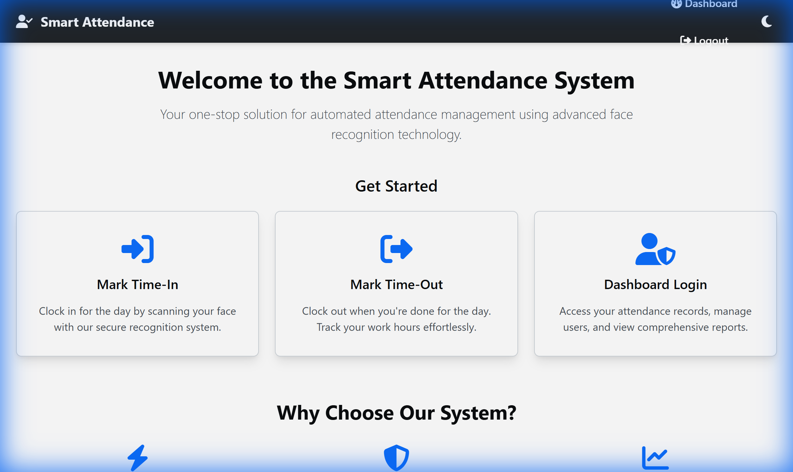
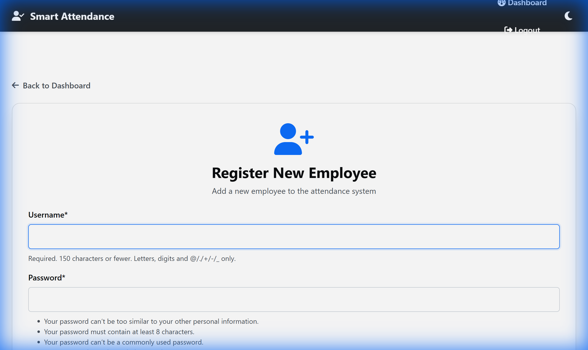

# User Guide

This guide provides a comprehensive walkthrough of the Attendance Management System Using Face Recognition, designed for non-technical users. It covers everything from logging in to interpreting attendance reports.

## Quick Start

If you are new to the system, start with the [Quick Start Guide](QUICKSTART.md) to get a demo running in minutes.

## 1. Core Concepts

- **Face Recognition:** The system uses a webcam to identify employees by their unique facial features. Each face is converted into a secure digital signature (an "embedding"). When an employee clocks in or out, the system compares the new embedding to the stored ones to find a match.
- **Attendance Record:** A timestamped entry that confirms when an employee has checked in or out.
- **Dashboard:** The main screen after logging in, providing access to all features. Admins and employees see different dashboards tailored to their roles.

## 2. Step-by-Step Instructions

### Logging In

1. Navigate to the system's home page.

    

    *The home page shows the main actions: Mark Time-In, Mark Time-Out, and Dashboard Login.*

2. Click on the **Dashboard Login** button.
3. Enter your username and password.

    

    *Enter your credentials on the login page.*

4. Click **Login**.

### For Employees

#### Marking Attendance

1. From the home page, click **Mark Time-In** to clock in for the day.
2. Position your face in front of the webcam. The system will automatically recognize you and record your check-in time.
3. When you click the **Capture & Recognize** button, you'll see a brief flash effect indicating that your photo has been captured.
4. At the end of the day, click **Mark Time-Out** to clock out.
5. If the banner "Liveness check failed. Please blink or move your head slightly and try again before marking attendance." appears, blink twice or gently move your head so the system can detect natural motion before retrying.

#### Viewing Your Attendance

1. Log in to your dashboard.
2. Select a date range to view your attendance history.
3. The system will display a table with your check-in and check-out times, as well as the total hours worked for each day.

### For Admins

After logging in as an admin, you will see the Admin Dashboard with a first-run checklist (if setup is incomplete) and quick-action cards.


*The admin dashboard provides quick access to employee management, photo capture, and reports.*

#### Registering a New Employee

1. Log in to your admin dashboard.
2. Click on **Register Employee**.

    

    *The registration form for adding a new employee to the system.*

3. Fill in the new employee's details (username, full name, role, and department) and click **Register**. The form validates duplicates automatically and prompts you to upload profile photos during the next step.

#### Adding Employee Photos

1. From the admin dashboard, click on **Add Photos**.
2. Enter the username of the employee and click **Add Photos**.
3. The system will automatically capture a set of images to create a face profile for the employee. Ensure the employee is in a well-lit area and facing the camera.

> [!TIP]
> For best recognition accuracy, capture **8-12 images** per employee under varied lighting and poses. See the [Training Protocol](TRAINING_PROTOCOL.md) for detailed guidance on diverse data collection.

#### Running an Attendance Session

The Attendance Session view provides a live feed of recognition attempts with real-time results.

1. From the admin dashboard, click on **Attendance Session**.
2. The session page displays:
    - Recent recognition attempts with timestamps
    - Match confidence scores
    - Liveness detection outcomes
    - Check-in/check-out controls

#### Viewing Attendance Reports

Admins have access to several attendance reports:

- **Attendance by Date:** View a list of all employees who were present on a specific date, along with their work hours.
- **Attendance by Employee:** View the complete attendance history for a single employee over a selected date range.

## 3. Interpreting the Results

The attendance reports provide the following information:

- **Time In:** The first recorded check-in time for the day.
- **Time Out:** The last recorded check-out time for the day.
- **Hours:** The total hours worked for the day.
- **Break Hours:** The total time spent on breaks.

The system also generates graphs to help you visualize attendance trends.

## 4. Troubleshooting

- **Recognition Issues:** If the system is having trouble recognizing an employee, ensure they are in a well-lit area and facing the camera directly. If the problem persists, an admin may need to recapture the employee's photos.
- **Liveness Prompts:** When the system rejects an attempt with the message above, keep your face within the guide box, blink, and tilt your head slightly until the status indicator turns green.
- **Incorrect Timestamps:** If you notice any incorrect timestamps in your attendance records, please contact an administrator to have them corrected.

## 5. Model Evaluation Reports

Administrators who need to verify recognition quality can generate a full evaluation report from the command line:

```bash
python manage.py eval --split-csv reports/splits.csv
```

The command reuses the live recognition engine to process the encrypted image dataset and stores its findings in `reports/evaluation/`:

- `metrics_summary.json` – accuracy, precision, recall, macro F1, False Acceptance Rate (FAR), and False Rejection Rate (FRR).
- `confusion_matrix.csv` / `.png` – shows which identities are confused most often and whether "Unknown" predictions occur frequently.
- `threshold_sweep.csv` / `.png` – plots how FAR, FRR, accuracy, and F1 change as you tighten or loosen the distance threshold.

Use these reports to fine-tune thresholds before rolling changes into production or to document the system's performance for compliance reviews.

> **How to read the distance column:** The evaluator stores cosine distance for every prediction using `sim(A, B) = (A · B) / (||A|| ||B||)` and `d(A, B) = 1 − sim(A, B)`. Lower values mean the faces are more similar. The live service accepts a match when `d(A, B) ≤ 0.4`, and the threshold sweep demonstrates how FAR increases and FRR decreases as you relax that bound. Review the CSV/PNG outputs when deciding whether to tighten or loosen the threshold for your deployment.
> **Tip for reviewers:** The repository includes a `sample_data/` directory with three synthetic identities so you can rehearse the full workflow without using production assets. Running `make reproduce` will point the evaluation pipeline at that demo dataset and deposit artifacts under `reports/sample_repro/`.

## 6. Responsible Use & Limitations

- **Fairness audit:** Run `python manage.py fairness_audit --split-csv reports/splits.csv --reports-dir reports/fairness` after major enrollment batches or hardware changes. The command captures recognition accuracy, precision/recall, and FAR/FRR for different user-role buckets, commonly used sites, capture sources, and coarse lighting conditions. Review the generated `reports/fairness/summary.md` so you can identify groups that require additional training photos or new lighting guidance.
- **Documentation:** The [Fairness & Limitations](FAIRNESS_AND_LIMITATIONS.md) report explains the methodology, interprets the findings, and lists known blind spots such as the absence of demographic labels. Pair it with the [DATA_CARD.md](DATA_CARD.md) before deploying to new regions so operators understand how the system behaves today and what still needs manual review.
